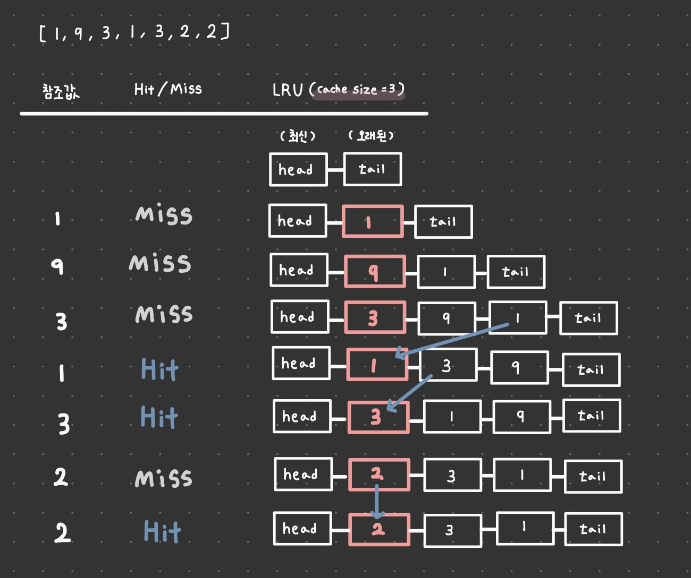

```js
function solution(cacheSize, cities) {
  const cache = []; // 과거 - 최신
  const HIT = 1;
  const MISS = 5;

  let runTime = 0;

  for (let city of cities) {
    city = city.toLowerCase(); // 대소문자 구분안함

    if (cache.length > cacheSize) {
      // 캐시사이즈 넘는 경우 오래된 캐싱 데이터 순으로 제거
      cache.shift();
    }

    // Hit인 경우
    if (cache.includes(city)) {
      cache.splice(cache.indexOf(city), 1); // cache에서 city 제거
      cache.push(city); // cache에 city 푸시
      runTime += HIT;
      // Miss인 경우
    } else {
      cache.push(city);
      runTime += MISS;
    }
  }
  return runTime;
}
```

- 캐시 교체 알고리즘은 `LRU(Least Recently Used)`를 사용한다.

## LRU?

- LRU(Least Recently Used)는 **가장 오랫동안 참조되지 않은 페이지를 교체**하는 방식이다

  - LRU 는 사용된지 가장 오래된 페이지는 앞으로도 사용될 확률이 낮다는 가설에 의해 만들어진 알고리즘!

- LRU 를 구현하기 위해서는 캐시가 가득 찼을때, **가장 오랫동안 참조되지 않은 페이지를 찾아서 없애**는 과정이 필요하다.

- 페이지를 새로 참조할 때마다 연결리스트의 맨 앞에 페이지번호를 추가! (맨 뒤에 있는 번호는 가장 오랫동안 참조되지 않은 번호)

- 아래는 예시이다!



- 캐시의 크기가 3인데 이미 3개의 페이지가 캐시에 들어있다면, 오래된 페이지번호 node 를 지우고 새로운 페이지번호 node 를 앞에 연결해주는 방식이다.

  - LRU를 구현할때는 Doubly Linked List 를 사용하며,
  - head 에 가까운 node 일수록 가장 최근에 참조된 페이지이고,
  - tail 에 가까운 node 일수록 가장 오랫동안 참조되지 않는 페이지이다.
  - LRU는 cache size 를 넘어서게 된다면 tail 에 가까운 페이지 (오래동안 참조되지 않은 페이지)가 먼저 삭제된다.
